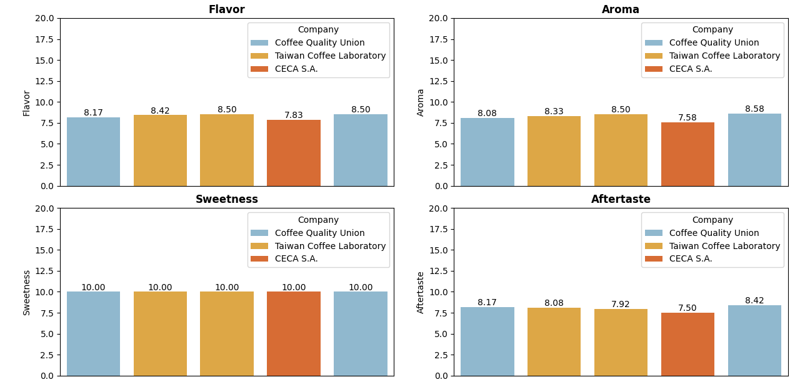
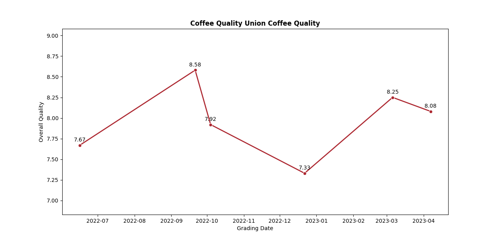

# Coffee Quality Analysis
Projeto em andamento dedicado a análise de um dataset retirado do Kaggle sobre qualidade de cafés.

<strong>Créditos do dataset:</strong> 
[Coffee Quality Data (CQI May-2023)](https://www.kaggle.com/datasets/fatihb/coffee-quality-data-cqi)

### Comparação entre os 5 melhores cafés em termos de qualidade geral, considerando algumas características importantes como sabor e aroma

### Gráfico que mostra o desempenho geral dos cafés da marca que detém o café de melhor qualidade, durante os anos 2022-2023

